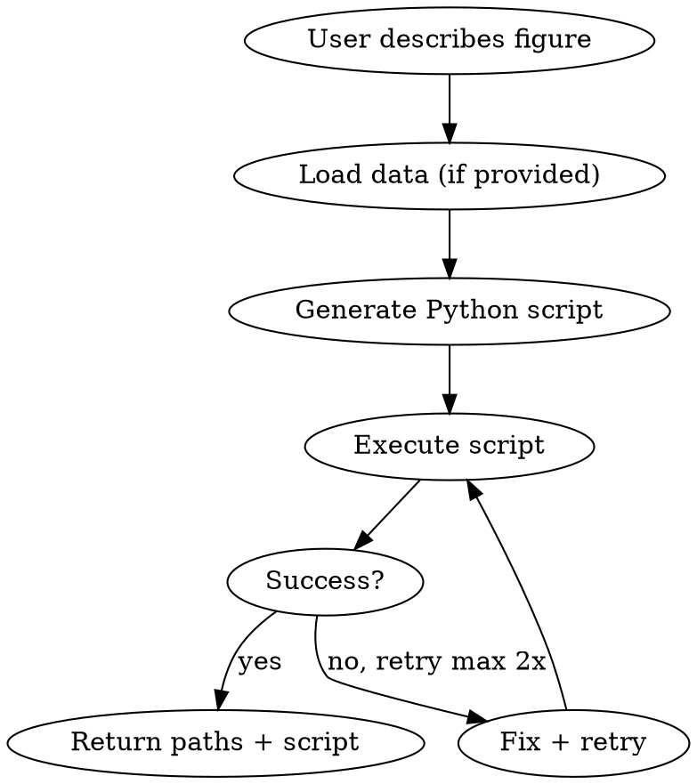

# acaplot

## Overview

Generate publication-ready academic figures for CS/ML/AI papers. Produces complete Python scripts and rendered PDF + PNG output from natural language descriptions.

## When to Use

- User asks to plot, visualize, or chart data
- User needs a diagram (architecture, flow, pipeline)
- User wants a mathematical or geometric figure
- User needs a network or relationship graph

## Workflow



1. Understand what figure the user needs (type, data, style requirements)
2. Load data if provided (file path or inline)
3. Generate a self-contained Python script
4. Execute the script via Bash using `.venv/bin/python3` (create venv first if missing)
5. Return file paths of PDF + PNG and the script

## Tool Selection

| Figure Type | Primary Tools |
|-------------|--------------|
| Line / bar / scatter / box / error plots | `matplotlib.pyplot` + `seaborn` |
| Heatmaps / confusion matrices | `seaborn.heatmap` / `matplotlib.imshow` |
| Architecture / flow diagrams | `matplotlib.patches` (FancyBboxPatch, FancyArrowPatch) + `ax.annotate` |
| Mathematical / geometric | `numpy` + `matplotlib.pyplot` |
| Network / relationship | `networkx` + `matplotlib.pyplot` |

## Environment Setup

Before running any generated script, ensure the virtual environment exists:

```bash
python3 -m venv .venv
.venv/bin/pip install matplotlib seaborn numpy pandas networkx scikit-learn
```

Always execute scripts with `.venv/bin/python3` instead of the system Python.

## Academic Style (CS/ML)

Apply these rcParams at the top of every generated script:

```python
plt.rcParams.update({
    "font.family": "serif",
    "font.serif": ["Times New Roman", "Computer Modern"],
    "font.size": 10,
    "axes.labelsize": 12,
    "axes.titlesize": 14,
    "xtick.labelsize": 10,
    "ytick.labelsize": 10,
    "legend.fontsize": 10,
    "figure.dpi": 150,
    "savefig.dpi": 300,
    "savefig.bbox": "tight",
    "savefig.pad_inches": 0.05,
})
```

Additional rules:
- Use `seaborn.color_palette("colorblind")` by default
- Always call `plt.tight_layout()` before saving
- Use `sns.despine()` for data plots
- Figure widths: single-column 3.5", double-column 7.0"
- Respect explicit user color/style overrides

## Output Specification

- Save to `./figures/` (create if missing with `os.makedirs("figures", exist_ok=True)`)
- Always output both PDF (vector) and PNG (300 DPI)
- Script file shares same base name as output figures
- Print saved file paths on completion

## Script Structure

Every generated script follows this structure:

```python
import os
import numpy as np
import matplotlib.pyplot as plt
import seaborn as sns

os.makedirs("figures", exist_ok=True)

plt.rcParams.update({...})

# Load data from file, inline, or generate with numpy
# ...

# Create figure
fig, ax = plt.subplots(figsize=(...))
# ... plotting code ...
plt.tight_layout()
fig.savefig("figures/name.pdf")
fig.savefig("figures/name.png")
print("Saved: figures/name.pdf, figures/name.png")
```

## Templates

Reference templates in `templates/` for common figure types:
- `training_curves.py` — Loss/accuracy over epochs
- `bar_chart.py` — Ablation study with error bars
- `heatmap.py` — Confusion matrix
- `scatter.py` — Cluster visualization (t-SNE/UMAP style)
- `architecture_diagram.py` — Block diagram with arrows
- `network_graph.py` — Directed graph
- `box_plot.py` — Distribution comparison (box/violin)
- `roc_curve.py` — ROC/PR curves for classification evaluation
- `subplot_layout.py` — Multi-panel figure with subplots
- `attention_heatmap.py` — Transformer attention weights visualization
- `grouped_bar.py` — Multi-dataset grouped comparison with error bars

Read relevant template before generating code. Adapt to user request — do not copy verbatim.

## Error Handling

- If script execution fails: read stderr, fix the error, retry (max 2 retries)
- Missing `./figures/` directory: script creates it automatically
- Missing library: install via `.venv/bin/pip install <name>` (never use system pip)

## Common Mistakes

| Mistake | Fix |
|---------|-----|
| Clipped labels | Add `plt.tight_layout()` before save |
| Inconsistent fonts | Set rcParams at script top |
| Unreadable for colorblind | Use `seaborn.color_palette("colorblind")` |
| FileNotFoundError | Include `os.makedirs("figures", exist_ok=True)` |
| Non-portable paths | Use relative paths, never absolute |
| Only one format | Always save both PDF and PNG |
| Pixelated output | Set `savefig.dpi: 300` |
