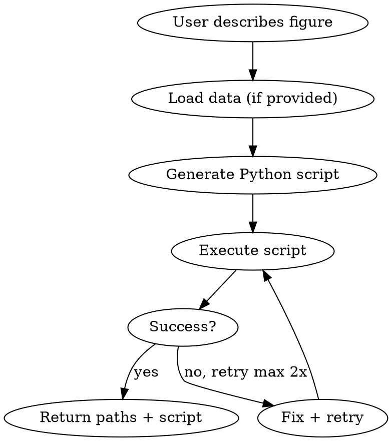

# acaplot Skill Implementation Plan

> **For agentic workers:** REQUIRED SUB-SKILL: Use superpowers:subagent-driven-development (recommended) or superpowers:executing-plans to implement this plan task-by-task. Steps use checkbox (`- [ ]`) syntax for tracking.

**Goal:** Create a superpowers skill that generates publication-ready CS/ML academic figures (data plots, architecture diagrams, math figures, network graphs) using matplotlib + seaborn + networkx.

**Architecture:** Single SKILL.md instruction file + 6 template Python scripts in `templates/`. Skill is triggered by figure/plot/diagram requests. Generates self-contained Python scripts, executes them, returns PDF + PNG + script path.

**Tech Stack:** Python 3, matplotlib, seaborn, numpy, pandas, networkx

---

### Task 1: Environment Check + Directory Setup

**Files:**
- Create: `templates/` directory

- [ ] **Step 1: Verify Python and required libraries**

```bash
python3 -c "import matplotlib; import seaborn; import numpy; import pandas; import networkx; print('All dependencies available')"
```

Expected: `All dependencies available`

If any import fails, install: `pip3 install matplotlib seaborn numpy pandas networkx`

- [ ] **Step 2: Create templates directory**

```bash
mkdir -p templates
```

- [ ] **Step 3: Commit**

```bash
git add -A && git commit -m "chore: add templates directory"
```

---

### Task 2: Training Curves Template

**Files:**
- Create: `templates/training_curves.py`

- [ ] **Step 1: Write template script**

```python
import os
import numpy as np
import matplotlib.pyplot as plt
import seaborn as sns

os.makedirs("figures", exist_ok=True)

plt.rcParams.update({
    "font.family": "serif",
    "font.serif": ["Times New Roman", "Computer Modern"],
    "font.size": 10,
    "axes.labelsize": 12,
    "axes.titlesize": 14,
    "xtick.labelsize": 10,
    "ytick.labelsize": 10,
    "legend.fontsize": 10,
    "figure.dpi": 150,
    "savefig.dpi": 300,
    "savefig.bbox": "tight",
    "savefig.pad_inches": 0.05,
})

sns.set_palette("colorblind")

epochs = np.arange(1, 101)
train_loss = 1.0 / np.sqrt(epochs) + np.random.normal(0, 0.02, len(epochs))
val_loss = 1.0 / np.sqrt(epochs) + 0.05 + np.random.normal(0, 0.03, len(epochs))

fig, ax = plt.subplots(figsize=(3.5, 2.5))
ax.plot(epochs, train_loss, label="Train")
ax.plot(epochs, val_loss, label="Validation")
ax.set_xlabel("Epoch")
ax.set_ylabel("Loss")
ax.legend()
sns.despine(ax=ax)
plt.tight_layout()
fig.savefig("figures/training_curves.pdf")
fig.savefig("figures/training_curves.png")
print("Saved: figures/training_curves.pdf, figures/training_curves.png")
```

- [ ] **Step 2: Run and verify output**

```bash
cd /Users/panda/Documents/repo/acaplot_skill && python3 templates/training_curves.py
```

Expected: `Saved: figures/training_curves.pdf, figures/training_curves.png` and both files exist in `./figures/`.

```bash
ls -la figures/training_curves.pdf figures/training_curves.png
```

Expected: Both files listed with non-zero size.

- [ ] **Step 3: Commit**

```bash
git add templates/training_curves.py && git commit -m "feat: add training curves template"
```

---

### Task 3: Bar Chart Template

**Files:**
- Create: `templates/bar_chart.py`

- [ ] **Step 1: Write template script**

```python
import os
import numpy as np
import matplotlib.pyplot as plt
import seaborn as sns

os.makedirs("figures", exist_ok=True)

plt.rcParams.update({
    "font.family": "serif",
    "font.serif": ["Times New Roman", "Computer Modern"],
    "font.size": 10,
    "axes.labelsize": 12,
    "axes.titlesize": 14,
    "xtick.labelsize": 10,
    "ytick.labelsize": 10,
    "legend.fontsize": 10,
    "figure.dpi": 150,
    "savefig.dpi": 300,
    "savefig.bbox": "tight",
    "savefig.pad_inches": 0.05,
})

methods = ["Baseline", "+Data", "+Augment", "+Pretrain", "Ours"]
means = [72.3, 75.1, 76.8, 78.2, 81.5]
stds = [1.2, 0.9, 1.1, 0.8, 0.7]

fig, ax = plt.subplots(figsize=(3.5, 2.5))
x = np.arange(len(methods))
colors = sns.color_palette("colorblind", len(methods))
ax.bar(x, means, yerr=stds, capsize=3, color=colors, edgecolor="black", linewidth=0.5)
ax.set_xticks(x)
ax.set_xticklabels(methods, rotation=30, ha="right")
ax.set_ylabel("Accuracy (%)")
ax.set_ylim(65, 85)
sns.despine(ax=ax)
plt.tight_layout()
fig.savefig("figures/bar_chart.pdf")
fig.savefig("figures/bar_chart.png")
print("Saved: figures/bar_chart.pdf, figures/bar_chart.png")
```

- [ ] **Step 2: Run and verify output**

```bash
cd /Users/panda/Documents/repo/acaplot_skill && python3 templates/bar_chart.py
```

Expected: `Saved: figures/bar_chart.pdf, figures/bar_chart.png` and both files exist.

- [ ] **Step 3: Commit**

```bash
git add templates/bar_chart.py && git commit -m "feat: add bar chart template"
```

---

### Task 4: Heatmap Template

**Files:**
- Create: `templates/heatmap.py`

- [ ] **Step 1: Write template script**

```python
import os
import numpy as np
import matplotlib.pyplot as plt
import seaborn as sns

os.makedirs("figures", exist_ok=True)

plt.rcParams.update({
    "font.family": "serif",
    "font.serif": ["Times New Roman", "Computer Modern"],
    "font.size": 10,
    "axes.labelsize": 12,
    "axes.titlesize": 14,
    "xtick.labelsize": 10,
    "ytick.labelsize": 10,
    "legend.fontsize": 10,
    "figure.dpi": 150,
    "savefig.dpi": 300,
    "savefig.bbox": "tight",
    "savefig.pad_inches": 0.05,
})

classes = ["Cat", "Dog", "Bird", "Fish", "Horse"]
cm = np.array([
    [45, 2, 1, 0, 2],
    [3, 40, 0, 1, 1],
    [1, 0, 38, 5, 1],
    [0, 1, 4, 42, 3],
    [2, 1, 0, 2, 44],
])
cm_normalized = cm / cm.sum(axis=1, keepdims=True)

fig, ax = plt.subplots(figsize=(3.5, 3))
sns.heatmap(cm_normalized, annot=True, fmt=".2f", cmap="Blues",
            xticklabels=classes, yticklabels=classes, ax=ax,
            vmin=0, vmax=1, linewidths=0.5, linecolor="gray")
ax.set_xlabel("Predicted")
ax.set_ylabel("True")
ax.set_title("Confusion Matrix")
plt.tight_layout()
fig.savefig("figures/heatmap.pdf")
fig.savefig("figures/heatmap.png")
print("Saved: figures/heatmap.pdf, figures/heatmap.png")
```

- [ ] **Step 2: Run and verify output**

```bash
cd /Users/panda/Documents/repo/acaplot_skill && python3 templates/heatmap.py
```

Expected: `Saved: figures/heatmap.pdf, figures/heatmap.png` and both files exist.

- [ ] **Step 3: Commit**

```bash
git add templates/heatmap.py && git commit -m "feat: add heatmap template"
```

---

### Task 5: Scatter Plot Template

**Files:**
- Create: `templates/scatter.py`

- [ ] **Step 1: Write template script**

```python
import os
import numpy as np
import matplotlib.pyplot as plt
import seaborn as sns

os.makedirs("figures", exist_ok=True)

plt.rcParams.update({
    "font.family": "serif",
    "font.serif": ["Times New Roman", "Computer Modern"],
    "font.size": 10,
    "axes.labelsize": 12,
    "axes.titlesize": 14,
    "xtick.labelsize": 10,
    "ytick.labelsize": 10,
    "legend.fontsize": 10,
    "figure.dpi": 150,
    "savefig.dpi": 300,
    "savefig.bbox": "tight",
    "savefig.pad_inches": 0.05,
})

np.random.seed(42)
n = 100
cluster1 = np.random.randn(n, 2) + [-2, 1]
cluster2 = np.random.randn(n, 2) + [2, -1]
cluster3 = np.random.randn(n, 2) + [0, 3]

fig, ax = plt.subplots(figsize=(3.5, 2.5))
palette = sns.color_palette("colorblind", 3)
ax.scatter(cluster1[:, 0], cluster1[:, 1], s=10, alpha=0.7, label="Class A", color=palette[0])
ax.scatter(cluster2[:, 0], cluster2[:, 1], s=10, alpha=0.7, label="Class B", color=palette[1])
ax.scatter(cluster3[:, 0], cluster3[:, 1], s=10, alpha=0.7, label="Class C", color=palette[2])
ax.set_xlabel("t-SNE Dim 1")
ax.set_ylabel("t-SNE Dim 2")
ax.legend(markerscale=2)
sns.despine(ax=ax)
plt.tight_layout()
fig.savefig("figures/scatter.pdf")
fig.savefig("figures/scatter.png")
print("Saved: figures/scatter.pdf, figures/scatter.png")
```

- [ ] **Step 2: Run and verify output**

```bash
cd /Users/panda/Documents/repo/acaplot_skill && python3 templates/scatter.py
```

Expected: `Saved: figures/scatter.pdf, figures/scatter.png` and both files exist.

- [ ] **Step 3: Commit**

```bash
git add templates/scatter.py && git commit -m "feat: add scatter plot template"
```

---

### Task 6: Architecture Diagram Template

**Files:**
- Create: `templates/architecture_diagram.py`

- [ ] **Step 1: Write template script**

```python
import os
import matplotlib.pyplot as plt
from matplotlib.patches import FancyBboxPatch

os.makedirs("figures", exist_ok=True)

plt.rcParams.update({
    "font.family": "serif",
    "font.serif": ["Times New Roman", "Computer Modern"],
    "font.size": 10,
    "figure.dpi": 150,
    "savefig.dpi": 300,
    "savefig.bbox": "tight",
    "savefig.pad_inches": 0.05,
})

fig, ax = plt.subplots(figsize=(7, 2.5))
ax.set_xlim(0, 10)
ax.set_ylim(0, 3)
ax.axis("off")

blocks = [
    (0.3, 0.8, 1.4, 1.2, "Input\n(224x224)", "#E8F4FD"),
    (2.1, 0.8, 1.4, 1.2, "Conv\nBlock 1", "#B3D9F2"),
    (3.9, 0.8, 1.4, 1.2, "Conv\nBlock 2", "#80BFE6"),
    (5.7, 0.8, 1.4, 1.2, "FC\nLayers", "#4DA6D9"),
    (7.5, 0.8, 1.4, 1.2, "Softmax\nOutput", "#1A8CCC"),
]

for (x, y, w, h, label, color) in blocks:
    box = FancyBboxPatch((x, y), w, h,
                          boxstyle="round,pad=0.1",
                          facecolor=color, edgecolor="black",
                          linewidth=1)
    ax.add_patch(box)
    ax.text(x + w / 2, y + h / 2, label,
            ha="center", va="center", fontsize=9,
            fontfamily="sans-serif")

for i in range(len(blocks) - 1):
    x1 = blocks[i][0] + blocks[i][2]
    x2 = blocks[i + 1][0]
    y_mid = blocks[i][1] + blocks[i][3] / 2
    ax.annotate("", xy=(x2, y_mid), xytext=(x1, y_mid),
                arrowprops=dict(arrowstyle="->", color="black", lw=1.5))

plt.tight_layout()
fig.savefig("figures/architecture_diagram.pdf")
fig.savefig("figures/architecture_diagram.png")
print("Saved: figures/architecture_diagram.pdf, figures/architecture_diagram.png")
```

- [ ] **Step 2: Run and verify output**

```bash
cd /Users/panda/Documents/repo/acaplot_skill && python3 templates/architecture_diagram.py
```

Expected: `Saved: figures/architecture_diagram.pdf, figures/architecture_diagram.png` and both files exist.

- [ ] **Step 3: Commit**

```bash
git add templates/architecture_diagram.py && git commit -m "feat: add architecture diagram template"
```

---

### Task 7: Network Graph Template

**Files:**
- Create: `templates/network_graph.py`

- [ ] **Step 1: Write template script**

```python
import os
import networkx as nx
import matplotlib.pyplot as plt

os.makedirs("figures", exist_ok=True)

plt.rcParams.update({
    "font.family": "serif",
    "font.serif": ["Times New Roman", "Computer Modern"],
    "font.size": 10,
    "figure.dpi": 150,
    "savefig.dpi": 300,
    "savefig.bbox": "tight",
    "savefig.pad_inches": 0.05,
})

G = nx.DiGraph()
edges = [
    ("Input", "Encoder"),
    ("Encoder", "Attention"),
    ("Attention", "FFN"),
    ("FFN", "Decoder"),
    ("Decoder", "Output"),
    ("Attention", "Encoder"),
]
G.add_edges_from(edges)

fig, ax = plt.subplots(figsize=(3.5, 2.5))
pos = nx.spring_layout(G, seed=42, k=1.5)
nx.draw(G, pos, ax=ax, with_labels=True,
        node_color="#B3D9F2", node_size=600,
        font_size=8, font_family="sans-serif",
        edge_color="gray", arrows=True,
        arrowsize=12, linewidths=1,
        edgecolors="black")
plt.tight_layout()
fig.savefig("figures/network_graph.pdf")
fig.savefig("figures/network_graph.png")
print("Saved: figures/network_graph.pdf, figures/network_graph.png")
```

- [ ] **Step 2: Run and verify output**

```bash
cd /Users/panda/Documents/repo/acaplot_skill && python3 templates/network_graph.py
```

Expected: `Saved: figures/network_graph.pdf, figures/network_graph.png` and both files exist.

- [ ] **Step 3: Commit**

```bash
git add templates/network_graph.py && git commit -m "feat: add network graph template"
```

---

### Task 8: Create SKILL.md

**Files:**
- Create: `SKILL.md`

- [ ] **Step 1: Write SKILL.md**

```markdown
---
name: acaplot
description: Use when creating academic figures, plots, or diagrams for CS/ML/AI papers — including data visualizations, architecture diagrams, mathematical figures, and network graphs
---

# acaplot

## Overview

Generate publication-ready academic figures for CS/ML/AI papers. Produces complete Python scripts and rendered PDF + PNG output from natural language descriptions.

## When to Use

- User asks to plot, visualize, or chart data
- User needs a diagram (architecture, flow, pipeline)
- User wants a mathematical or geometric figure
- User needs a network or relationship graph

## Workflow



1. Understand what figure the user needs (type, data, style requirements)
2. Load data if provided (file path or inline)
3. Generate a self-contained Python script
4. Execute the script via Bash
5. Return file paths of PDF + PNG and the script

## Tool Selection

| Figure Type | Primary Tools |
|-------------|--------------|
| Line / bar / scatter / box / error plots | `matplotlib.pyplot` + `seaborn` |
| Heatmaps / confusion matrices | `seaborn.heatmap` / `matplotlib.imshow` |
| Architecture / flow diagrams | `matplotlib.patches` (FancyBboxPatch, FancyArrowPatch) + `ax.annotate` |
| Mathematical / geometric | `numpy` + `matplotlib.pyplot` |
| Network / relationship | `networkx` + `matplotlib.pyplot` |

## Academic Style (CS/ML)

Apply these rcParams at the top of every generated script:

```python
plt.rcParams.update({
    "font.family": "serif",
    "font.serif": ["Times New Roman", "Computer Modern"],
    "font.size": 10,
    "axes.labelsize": 12,
    "axes.titlesize": 14,
    "xtick.labelsize": 10,
    "ytick.labelsize": 10,
    "legend.fontsize": 10,
    "figure.dpi": 150,
    "savefig.dpi": 300,
    "savefig.bbox": "tight",
    "savefig.pad_inches": 0.05,
})
```

Additional rules:
- Use `seaborn.color_palette("colorblind")` by default
- Always call `plt.tight_layout()` before saving
- Use `sns.despine()` for data plots
- Figure widths: single-column 3.5", double-column 7.0"
- Respect explicit user color/style overrides

## Output Specification

- Save to `./figures/` (create if missing with `os.makedirs("figures", exist_ok=True)`)
- Always output both PDF (vector) and PNG (300 DPI)
- Script file shares same base name as output figures
- Print saved file paths on completion

## Script Structure

Every generated script follows this structure:

```python
import os
import numpy as np
import matplotlib.pyplot as plt
import seaborn as sns

os.makedirs("figures", exist_ok=True)

plt.rcParams.update({...})

# Load data from file, inline, or generate with numpy
# ...

# Create figure
fig, ax = plt.subplots(figsize=(...))
# ... plotting code ...
plt.tight_layout()
fig.savefig("figures/name.pdf")
fig.savefig("figures/name.png")
print("Saved: figures/name.pdf, figures/name.png")
```

## Templates

Reference templates in `templates/` for common figure types:
- `training_curves.py` — Loss/accuracy over epochs
- `bar_chart.py` — Ablation study with error bars
- `heatmap.py` — Confusion matrix
- `scatter.py` — Cluster visualization (t-SNE/UMAP style)
- `architecture_diagram.py` — Block diagram with arrows
- `network_graph.py` — Directed graph

Read relevant template before generating code. Adapt to user request — do not copy verbatim.

## Error Handling

- If script execution fails: read stderr, fix the error, retry (max 2 retries)
- Missing `./figures/` directory: script creates it automatically
- Missing library: report which library to install (`pip3 install <name>`)

## Common Mistakes

| Mistake | Fix |
|---------|-----|
| Clipped labels | Add `plt.tight_layout()` before save |
| Inconsistent fonts | Set rcParams at script top |
| Unreadable for colorblind | Use `seaborn.color_palette("colorblind")` |
| FileNotFoundError | Include `os.makedirs("figures", exist_ok=True)` |
| Non-portable paths | Use relative paths, never absolute |
| Only one format | Always save both PDF and PNG |
| Pixelated output | Set `savefig.dpi: 300` |
```

- [ ] **Step 2: Commit**

```bash
git add SKILL.md && git commit -m "feat: add SKILL.md with academic figure generation instructions"
```

---

### Task 9: Update README.md

**Files:**
- Modify: `README.md`

- [ ] **Step 1: Write README**

```markdown
# acaplot_skill

A superpowers skill for generating publication-ready academic figures for CS/ML/AI papers.

## What It Does

Given a natural language description (and optional data), generates:
- Complete Python scripts (matplotlib + seaborn + networkx)
- Rendered PDF (vector) + PNG (300 DPI) output

## Supported Figure Types

| Type | Examples |
|------|----------|
| Data visualization | Training curves, bar charts, scatter plots, heatmaps, box plots |
| Architecture diagrams | Model pipelines, block diagrams, flowcharts |
| Mathematical figures | Function curves, geometric diagrams |
| Network graphs | Dependency graphs, relationship diagrams |

## Usage

Load the skill and describe the figure you need:

> "Plot training and validation loss curves from results.csv"

> "Draw a Transformer architecture diagram with 6 encoder layers"

> "Scatter plot of t-SNE embeddings colored by class label"

## Templates

See `templates/` for reference implementations of common figure types.

## Requirements

Python 3 with: matplotlib, seaborn, numpy, pandas, networkx
```

- [ ] **Step 2: Commit**

```bash
git add README.md && git commit -m "docs: update README with skill documentation"
```

---

### Task 10: End-to-End Verification

- [ ] **Step 1: Clean generated figures**

```bash
rm -rf figures/
```

- [ ] **Step 2: Run all templates**

```bash
cd /Users/panda/Documents/repo/acaplot_skill && python3 templates/training_curves.py && python3 templates/bar_chart.py && python3 templates/heatmap.py && python3 templates/scatter.py && python3 templates/architecture_diagram.py && python3 templates/network_graph.py
```

Expected: All 6 scripts print "Saved" messages without errors.

- [ ] **Step 3: Verify all outputs**

```bash
ls figures/
```

Expected: 12 files (6 `.pdf` + 6 `.png`):
- `training_curves.pdf`, `training_curves.png`
- `bar_chart.pdf`, `bar_chart.png`
- `heatmap.pdf`, `heatmap.png`
- `scatter.pdf`, `scatter.png`
- `architecture_diagram.pdf`, `architecture_diagram.png`
- `network_graph.pdf`, `network_graph.png`

- [ ] **Step 4: Verify SKILL.md has valid frontmatter**

```bash
head -5 SKILL.md
```

Expected: Starts with `---`, contains `name: acaplot` and `description:` fields.

- [ ] **Step 5: Verify final repo structure**

```bash
find . -not -path './.git/*' -not -path './figures/*' -not -path './docs/*' -not -name '.DS_Store' | sort
```

Expected:
```
.
./LICENSE
./README.md
./SKILL.md
./templates
./templates/architecture_diagram.py
./templates/bar_chart.py
./templates/heatmap.py
./templates/network_graph.py
./templates/scatter.py
./templates/training_curves.py
```
